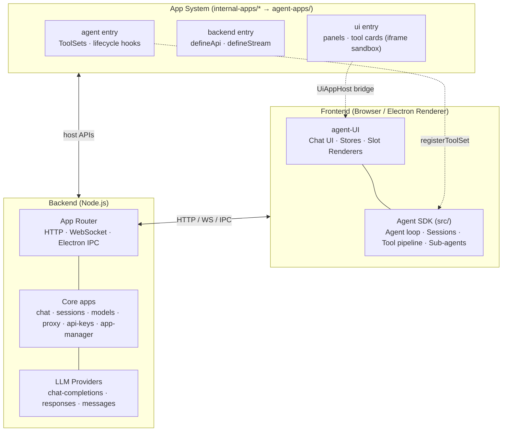

<p align="center">
  
</p>

<h1 align="center">Agent OS</h1>

<p align="center"><strong>An extensible, app-based operating system for AI agents.</strong></p>

Agent OS is a full-stack agent platform that combines a framework-agnostic Agent SDK, a Node.js backend, a React chat UI, and a VS Code–style *app system*. Everything the agent can do — run terminals, browse the web, manage files, plan tasks, call MCP servers — is contributed by self-contained apps, each shipping agent tools, backend APIs, and rich UI in one package.

Runs as a **web app** (Vite + Node backend) or as a **desktop app** (Electron), from the same codebase.

---

## Features

- 🧠 **Agent SDK** — framework-agnostic agent loop, sessions, tool execution pipeline, sub-agents, history compaction, and message converters for OpenAI / Anthropic / Gemini wire formats.
- 🧩 **App system** — VS Code–inspired extension model. Each app declares a `manifest.json` with up to three entry points: **agent** (tools & lifecycle hooks), **backend** (APIs & streams), and **UI** (panels, tool cards, buttons).
- 🖥️ **Rich UI slots** — apps render inline widgets or sandboxed iframes into slots such as `toolCard`, `compactToolCard`, `panel`, and `toolButton`.
- 🔌 **Universal app router** — one registration API (`defineApi` / `defineStream`) is exposed transparently over HTTP (`POST /api/app/<appId>/<method>`), WebSocket streams, and Electron IPC.
- 🤖 **Multi-provider LLM support** — DeepSeek, Doubao, Qwen, GLM, OpenAI-compatible endpoints and custom providers, with per-model capabilities (tool calling, vision, token limits) and encrypted API key storage.
- 📦 **Built-in apps** — terminal (PTY), browser automation (Playwright), file, git, MCP, plan, todo, skills, permissions, token budget, dynamic tools, variables, experience records, Azure DevOps, and more.
- 🧪 **Layered test suite** — Vitest configs for the backend, SDK, agent-type layer, and each individual app.
- 🚀 **One-command packaging** — build scripts produce a versioned release layout with a version-selecting launcher, for both the console (CUI) and Electron (GUI) flavors.

---

## Architecture



### Layers

| Directory | Role |
|---|---|
| `src/` | **Agent SDK** (`@agent-sdk`) — `createAgentClient`, `createAgentSession`, tool registry, conversation runner, 6-stage tool-call pipeline, sub-agent registry, vendor message converters. Published as an ES/CJS library. |
| `agent-type/` | **Type contract layer** (`@agent-type`) — pure types + a few runtime helpers shared by the SDK, backend, and apps: `Tool`, `ToolSet`, `AppManifest`, `AgentAppHost`, `BackendAppHost`, `UiAppHost`, `AppBridge`, `defineTool` / `buildTool`. |
| `agent-UI/` | **React frontend** — chat rendering, app manager, slot registry & iframe sandbox, provider/session stores, transport abstraction (HTTP/WS or Electron IPC). |
| `backend/` | **Node.js server** — app router, app scanner/installer, core apps (`system`, `proxy`, `models`, `model-config`, `sessions`, `chat`, `api-keys`, `app-manager`), LLM provider adapters, encrypted key store, DevTools-style HTTP network logging. |
| `internal-apps/` | **App source code** — one folder per built-in app; compiled into `agent-apps/` (gitignored build output). |
| `agent-OS/` | Demo entry point that boots the default UI. |
| `electron/` | Electron main & preload processes for the desktop (GUI) build. |
| `scripts/` | Build & dev orchestration (`gui:dev`, `gui:build`, `cui:dev`, `cui:build`, app compilation, native module rebuilds). |
| `release/` | Packaged, versioned releases with shared `data/`, `workspace/`, and `.agent/` directories. |

### The app model

Every app is a directory under `internal-apps/` with a `manifest.json`:

```json
{
  "id": "terminal",
  "name": "Terminal",
  "version": "0.1.0",
  "description": "Interactive terminal management with PTY-backed shells.",
  "agentEntry": "activate.js",
  "backendEntry": "backend.cjs",
  "uiEntry": "ui/index.html"
}
```

- **Agent entry** — `activate(host: AgentAppHost)` registers `ToolSet`s (tools + lifecycle hooks: system prompt fragments, tool filtering, context patching, result post-processing) and declares UI slots for its tools.
- **Backend entry** — registers API methods and streams via `host.defineApi` / `host.defineStream`; gets an app-scoped data directory, a scoped logger, and access to the inter-app **service registry** (`host.services.register/resolve`).
- **UI entry** — runs in a sandboxed iframe and communicates through `window.__UAP_APP_HOST__` (`UiAppHost`); renders panels, tool cards, and buttons into declared slots.
- **AppBridge** — a shared object reference between the agent and UI layers of the same app (no serialization).
- **Configuration** — manifests can declare typed config properties (VS Code `contributes.configuration` style), read at runtime via `host.getConfig('myapp.some.key')`.

### Built-in apps

| App | Description |
|---|---|
| `terminal` | PTY-backed interactive terminals (`terminal_create/read/send/wait/…`) plus a self-upgrade workflow. |
| `browser` | Playwright browser automation. |
| `file` | File read/write, search, workspace management, filesystem browser. |
| `git` | Status, diff, log, stage, commit, discard operations. |
| `mcp` | Model Context Protocol server management (list/add/remove/connect/disable). |
| `plan` | Structured task planning with markdown plans, checkpoints, and plan-mode restrictions. |
| `todo` | Task tracking with panel tab, progress badge, and chat tool cards. |
| `skill` | Skill install/list/remove with slash-command autocomplete. |
| `permissions` | Tool permission checking via `onBeforeToolExecute` with allow/deny/ask rules. |
| `token-budget` | Token usage tracking with automatic history compaction at budget thresholds. |
| `tool-state` | Default-off tool access control with a resident `manage_tools` tool. |
| `user-input` | Inline user prompting (`ask_user`) and message queuing during agent loops. |
| `variable` | JSON variable store with handle-based reference and expansion. |
| `dynamic-tool` | Create/update/delete dynamic agent tools, shared ESM modules, npm dependencies. |
| `experience` | Persistent trigger→insight records for agent pattern matching. |
| `devops` | Azure DevOps / Azure Boards work items, repos, builds, releases, sprints, test plans. |

---

## Getting started

### Prerequisites

- **Node.js** ≥ 22 (repo pins `26.3.0` via `.node-version`)
- **pnpm** 10.x (`packageManager: pnpm@10.6.5`)
- Windows build tooling (MSVC + Python) if you need native modules (`node-pty`, `better-sqlite3`) rebuilt for Electron

### Install

```bash
pnpm install
```

### Run in development

**Web / console mode (CUI)** — Vite dev server + Node backend, HTTP transport:

```bash
pnpm run cui:dev
```

**Desktop mode (GUI)** — interactive app selection, Vite HMR, and an Electron window:

```bash
pnpm run gui:dev
```

**Backend only:**

```bash
pnpm run backend        # node --env-file=.env backend/index.ts
```

Configuration lives in `.env` (e.g. `PORT`, defaults to `3001`). LLM providers and API keys are configured at runtime through the UI (stored encrypted under `data/`).

### Common scripts

| Script | Description |
|---|---|
| `pnpm run demo` | Vite dev server for the demo frontend |
| `pnpm run dev` | Build the SDK library in watch mode |
| `pnpm run build` | Typecheck + build SDK (ES/CJS + types) + standalone bundle |
| `pnpm run typecheck` | `tsc --noEmit` |
| `pnpm run cui:dev` / `cui:build` | Console flavor: dev servers / packaged release |
| `pnpm run gui:dev` / `gui:build` | Electron flavor: dev / packaged release |
| `pnpm run gui:compile` | Compile Electron main/preload/backend bundles |
| `pnpm run test` | Run all Vitest suites |
| `pnpm run test:sdk` | SDK + agent-type + agent-UI suites with coverage |

---

## Testing

Tests are layered, each with its own Vitest config:

```bash
# Backend
npx vitest run --config vitest.backend.config.ts

# SDK + agent-type + agent-UI (with coverage)
pnpm run test:sdk

# A single app — always launch from the repo root
npx vitest run --config internal-apps/terminal/vitest.config.ts
```

> **Note:** app test configs rely on relative-path `vi.mock` resolution, which is sensitive to the process working directory. Always run them from the repository root.

---

## Building releases

```bash
pnpm run cui:build     # console (pkg-based) release
pnpm run gui:build     # Electron desktop release
```

Both produce a versioned layout under `release/`:

```
release/
  <exe-name>.exe        ← version-selecting launcher
  current-version       ← active version pointer
  data/  workspace/  .agent/   ← shared mutable state (preserved across versions)
  v0.1.0-<timestamp>/   ← the actual build (exe, resources, frontend assets)
```

App compilation (`scripts/compile-apps.mjs`) builds every `internal-apps/<app>/` into `agent-apps/<app>/`, bundling its agent entry, backend entry, and UI entry.

---

## Using the Agent SDK standalone

The SDK (`src/`) is built as a framework-agnostic library (`@uap/agent-sdk`) with `zod` as its only peer dependency:

```ts
import { createAgentClient, createAgentSession } from '@uap/agent-sdk';

const client = createAgentClient({
  handler: myLLMHandler,      // (messages, { tools, systemPrompt, signal }) => stream
  systemPrompt: '...',
  toolSets: [myToolSet],
});
```

It provides the full agent loop: streaming turns, tool-call pipeline with validation and permission hooks, session persistence, sub-agents, attachments, token usage tracking, and history compaction.

---

## Project layout

```
agent-os/
├── src/               # Agent SDK (@agent-sdk)
├── agent-type/        # Shared type contracts (@agent-type)
├── agent-UI/          # React frontend (chat, slots, stores, transport)
├── agent-OS/          # Demo bootstrap entry
├── backend/           # Node.js server (router, core apps, providers)
├── internal-apps/     # Built-in app sources
├── agent-apps/        # Compiled app output (gitignored)
├── electron/          # Electron main/preload
├── scripts/           # Build & dev orchestration
├── data/              # Runtime data (provider config, sessions)
├── workspace/         # Agent working directory
└── release/           # Packaged releases
```

---

## License

TBD
