 AgentOS — AI Agent 插件集成平台

> *产品介绍文档 · 2026年8月*

---

# 一、产品概述

AgentOS 是一个面向 AI Agent 的插件化操作系统级平台。正如传统操作系统为应用程序提供进程调度、内存管理、文件系统和设备驱动等基础能力，AgentOS 为 AI Agent 提供了一套完整的基础设施：工具注册与调度、会话生命周期管理、插件热插拔、多模型适配、跨进程通信以及可扩展的 UI 框架。

AgentOS 的核心理念是——**让 AI Agent 像操作系统一样运行**。在 AgentOS 之上，开发者可以像开发"应用程序"一样开发插件；用户可以像安装"应用"一样安装和启用插件；AI 模型则像调用"系统调用"一样发现并调用工具。

---

# 二、核心架构

AgentOS 采用三层架构，每一层都有清晰的职责边界，通过类型契约而非运行时依赖进行耦合：

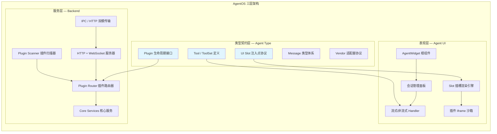

**类型契约层（Agent Type）**是整个平台的"宪法"——它定义了 Tool、ToolSet、Plugin、Slot、Message 等所有核心概念的类型接口。它不包含任何运行时代码，只输出纯 TypeScript 类型。上层实现面向接口编程，下层服务通过同一套类型契约与上层通信。这种设计确保了：

- **编译期安全**：插件开发时即可获得完整的类型提示和校验
- **运行期解耦**：UI 层和 Backend 层可以独立迭代
- **接口即文档**：类型定义本身就是最权威的 API 文档

---

# 三、OS 级能力详述

## 3.1 工具子系统 — 相当于 OS 的"系统调用"

AgentOS 将 AI Agent 可用的每一个能力抽象为**工具（Tool）**，类比于操作系统的系统调用。每个工具由 Zod Schema 定义输入参数的类型与约束，并包含一个异步执行函数。工具通过 **ToolSet** 进行分组管理，ToolSet 不仅是一组工具的容器，更是一个完整的生命周期挂钩集合：

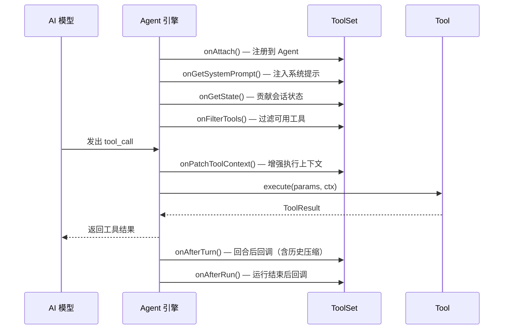

ToolSet 的生命周期钩子覆盖了工具从注册、调用到清理的全过程：

| 钩子 | 时机 | 能力 |
|------|------|------|
| `onAttach` | 注册到 Agent 时 | 获取 Agent 引用，注册动态工具 |
| `onGetSystemPrompt` | 每次 LLM 调用前 | 向系统提示注入上下文（可被其他 ToolSet 抑制） |
| `onGetState` | 状态快照时 | 贡献会话级状态数据 |
| `onFilterTools` | 工具列表下发前 | 按条件过滤可见工具集 |
| `onPatchToolContext` | 工具执行前 | 向执行上下文注入额外字段 |
| `onInterceptMessage` | 用户消息发送时 | 拦截消息，实现消息队列等模式 |
| `onAfterTurn` | 每轮对话后 | 执行后处理（如历史压缩/摘要） |
| `onAfterRun` | 整个 Agent 运行结束后 | 根据结束原因（完成/超限/中止/错误）响应 |

这种设计使得工具不再是孤立的函数，而是具有完整生命周期感知能力的"进程"。ToolSet 之间的协作也通过系统提示抑制、工具过滤等机制完成，类似于操作系统中的进程间通信与资源调度。

## 3.2 插件子系统 — 相当于 OS 的"应用程序框架"

AgentOS 的插件系统是整个平台最核心的"操作系统特性"。每个插件具备**三个独立的入口点**，分别运行在不同的运行时环境中：

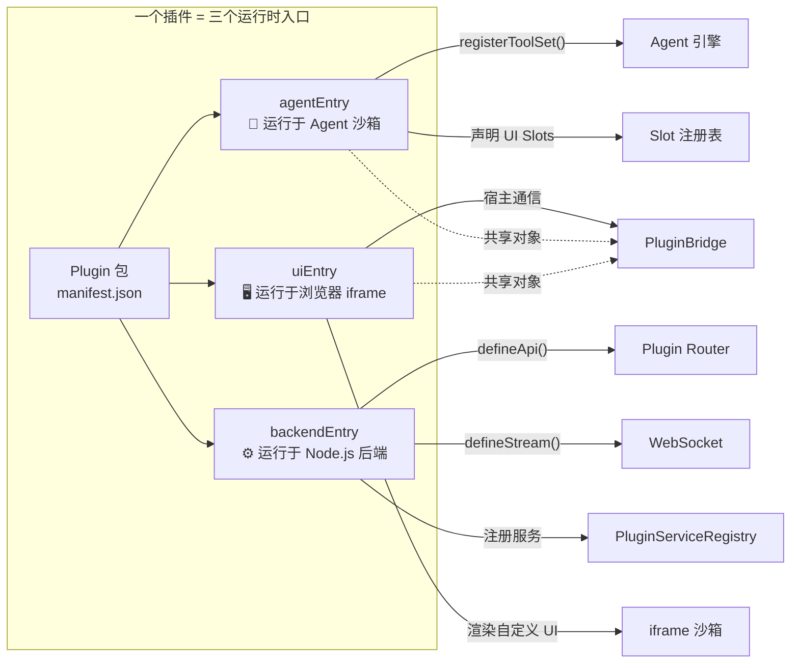

**三入口模型的价值**在于：

- **Agent 入口**：插件可以向 Agent 注册工具，扩展 AI 的能力边界。例如，Browser 插件注册浏览器自动化工具，File 插件注册文件操作工具。
- **Backend 入口**：插件可以注册 HTTP API 和 WebSocket 流，暴露需要 Node.js 运行时能力的后端服务。所有 API 统一通过 Plugin Router 路由。
- **UI 入口**：插件可以在平台 UI 的预定义插槽（Slot）中渲染自定义界面。UI 代码运行在沙箱 iframe 中，通过 `UiPluginHost` 与宿主通信。

**插件间的跨进程通信**由两套机制支撑：

- **PluginBridge**：Agent 侧和 UI 侧共享同一个按引用传递的对象，Agent 在激活时写入方法/属性，UI 直接读取调用。这是一种零序列化开销的通信方式。
- **PluginServiceRegistry**：Backend 侧的插件可以将服务注册到全局注册表，其他插件通过服务名解析并调用。这是一种类似 OS 中"服务管理器"的模式。

**插件生命周期管理**完整覆盖了插件的加载、激活、停用、启用/禁用、安装和卸载：

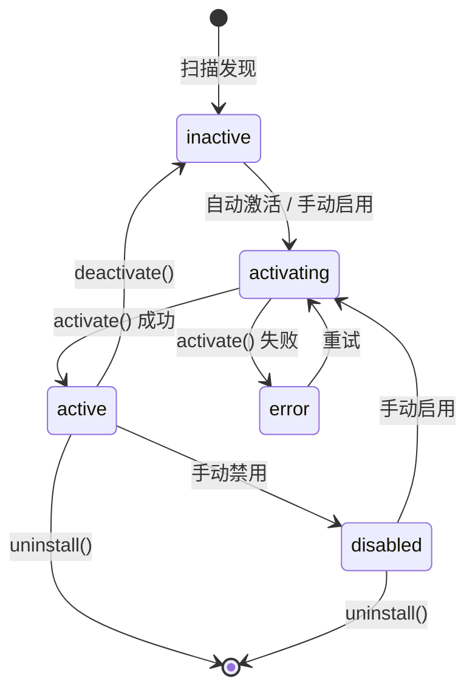

插件系统还支持**配置管理**——每个插件可以声明自己的配置 Schema（类似 VS Code 的 `contributes.configuration`），配置值通过 `PluginConfigClient` 读写，变更时通过回调通知所有监听方。

## 3.3 会话子系统 — 相当于 OS 的"进程管理"

AgentOS 将每一次与 AI 的对话抽象为**会话（Session）**。会话是平台中的一等公民，拥有完整的生命周期管理、状态持久化和恢复能力：

- **会话管理器（SessionManager）** 负责会话的创建、列表、切换和删除
- 每个会话维护完整的消息历史（UserMessage / AssistantMessage / ToolResultMessage）
- 会话状态通过 `AgentSessionState` 统一管理，各 ToolSet 通过 `onGetState` 贡献自己的状态分片
- 会话支持持久化到磁盘，重启后可恢复
- 子 Agent 架构：主会话可以派生子 Agent 对话，每个子 Agent 拥有独立的 conversationId 和上下文隔离

**双模对话引擎**支持流式（Streaming）和非流式（Async）两种模式，通过统一的 Handler 抽象消除差异：

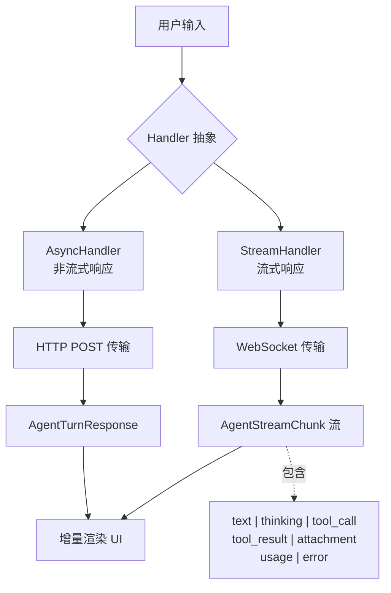

流式响应的每一个 Chunk 都有明确的类型标签（text、thinking、tool_call、tool_result、attachment、usage、error），UI 层据此进行差异化渲染。这种设计使得前端的"打字机效果"、思考过程展示、工具调用状态卡片等体验成为可能。

## 3.4 多供应商适配层 — 相当于 OS 的"硬件抽象层"

AgentOS 通过**供应商适配器（Vendor Adapter）**将不同 AI 厂商的 API 差异封装在统一的消息格式之下。平台内部使用一套与供应商无关的消息类型体系（UserMessage、AssistantMessage、ToolResultMessage），通过转换器输出为各供应商的原生格式：

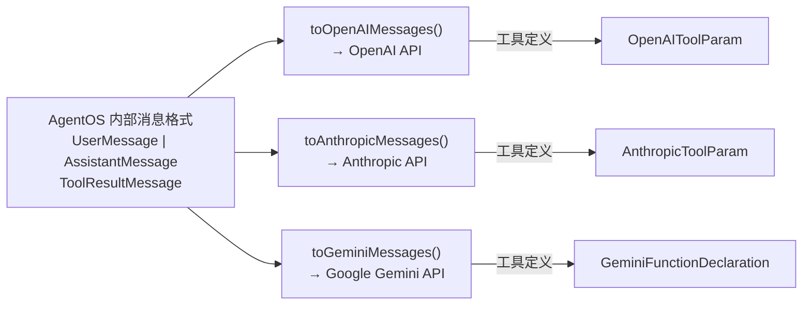

这种设计使得平台可以不绑定任何单一 AI 供应商，用户可以自由选择和切换模型。同时，**自定义端点（Custom Endpoint）** 支持接入任何兼容 OpenAI 接口格式的第三方服务。

## 3.5 UI 插槽系统 — 相当于 OS 的"窗口管理器"

AgentOS 的 UI 不是铁板一块，而是通过**插槽（Slot）系统**提供了 8 种预定义的 UI 注入点，插件可以在这些位置渲染自定义界面：

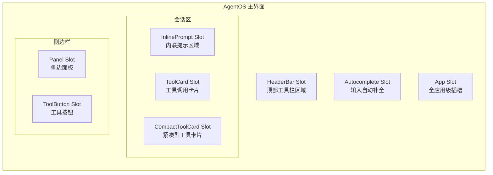

每个插槽对应一个独立的 iframe 实例，插件 UI 在其中运行并接收类型安全的消息协议。Slot 系统的工作流如下：

1. **声明**：插件在 `registerToolSet()` 时附加 Slot 声明，描述要注入的插槽类型和 UI 配置
2. **注册**：Slot 声明被写入全局 `SlotRegistry`
3. **发现**：UI 层按插槽类型从注册表中取出所有声明
4. **渲染**：`SlotRenderer` 为每个声明创建 `IframeSandbox` 实例
5. **通信**：宿主通过 `UiPluginHost` 向 iframe 推送 `SlotHostMessage`，iframe 通过 `postMessage` 回传

这种架构的妙处在于：**插件 UI 完全隔离**——一个插件的 UI 崩溃不会影响主界面；**通信是类型安全的**——每条消息都有明确的类型定义；**渲染是按需的**——只有当前激活会话需要的插槽才会渲染。

## 3.6 传输层 — 相当于 OS 的"网络栈"

AgentOS 支持两种传输模式，在编译期和运行期自动切换：

| 模式 | 传输 | 适用场景 |
|------|------|----------|
| **Standalone** | HTTP + WebSocket | 独立 Web 应用，浏览器直接连接后端 |
| **Electron IPC** | Electron IPC | 桌面应用，通过 `ipcMain`/`ipcRenderer` 通信 |

传输层对上透明——`PluginApiClient` 封装了所有差异，上层代码只调用 `apiClient.call(method, params)`，无需关心底层是 fetch 还是 `electronAPI.invoke`。WebSocket 用于流式数据传输，同样通过 `PluginStreamClient` 抽象。

---

# 四、内置插件一览

AgentOS 随平台交付 17 个内置插件，覆盖 AI Agent 工作所需的各个领域。以下按其"操作系统"中的角色进行归类：

## 系统服务类（OS Kernel Services）

| 插件 | 功能 | OS 类比 |
|------|------|---------|
| **variable** | 变量定义与引用，支持跨工具传递上下文 | 环境变量 / 寄存器 |
| **memory-graph** | 对话记忆图谱，结构化存储与检索 | 虚拟内存管理 |
| **tool-state** | 工具启用/禁用状态管理，核心工具豁免 | 进程调度策略 |
| **permissions** | 工具调用权限控制，允许/拒绝/询问 | 访问控制列表（ACL） |
| **token-budget** | Token 用量监控与预算管理 | 资源配额管理 |
| **tool-result-compressor** | 工具结果自动压缩，防止上下文溢出 | 内存压缩 / Swap |

## I/O 与外部交互类（OS I/O Subsystem）

| 插件 | 功能 | OS 类比 |
|------|------|---------|
| **file** | 文件系统读写、搜索、多工作区支持 | 文件系统驱动 |
| **terminal** | 终端命令执行，支持交互式会话 | Shell / 命令解释器 |
| **browser** | 浏览器自动化（Playwright），页面操作、截图 | 网络协议栈 |
| **git** | Git 版本控制操作 | 版本控制子系统 |
| **mcp** | Model Context Protocol 客户端，接入外部 MCP 服务 | 外部设备驱动 |

## 规划与执行类（OS Process & Task Management）

| 插件 | 功能 | OS 类比 |
|------|------|---------|
| **plan** | 任务规划与分解，结构化执行计划 | 任务调度器 |
| **todo** | 待办事项管理，进度跟踪 | 进程状态跟踪 |
| **skill** | 技能定义与管理，可复用的能力单元 | 动态链接库（DLL） |
| **dynamic-tool** | 动态工具创建，运行时定义新工具 | 即时编译（JIT） |
| **user-input** | 用户交互请求，支持确认/文本/选择/多选 | 用户模式中断 |
| **devops** | DevOps 流水线集成，多对话框批处理 | 批处理调度 |
| **experience** | 使用体验优化，上下文感知提示 | 用户体验守护进程 |

---

# 五、子 Agent 架构

AgentOS 支持**子 Agent（Sub-Agent）**——主 Agent 可以将复杂任务委托给独立的子 Agent，子 Agent 拥有独立的消息上下文、独立的工具集、以及独立的会话生命周期：

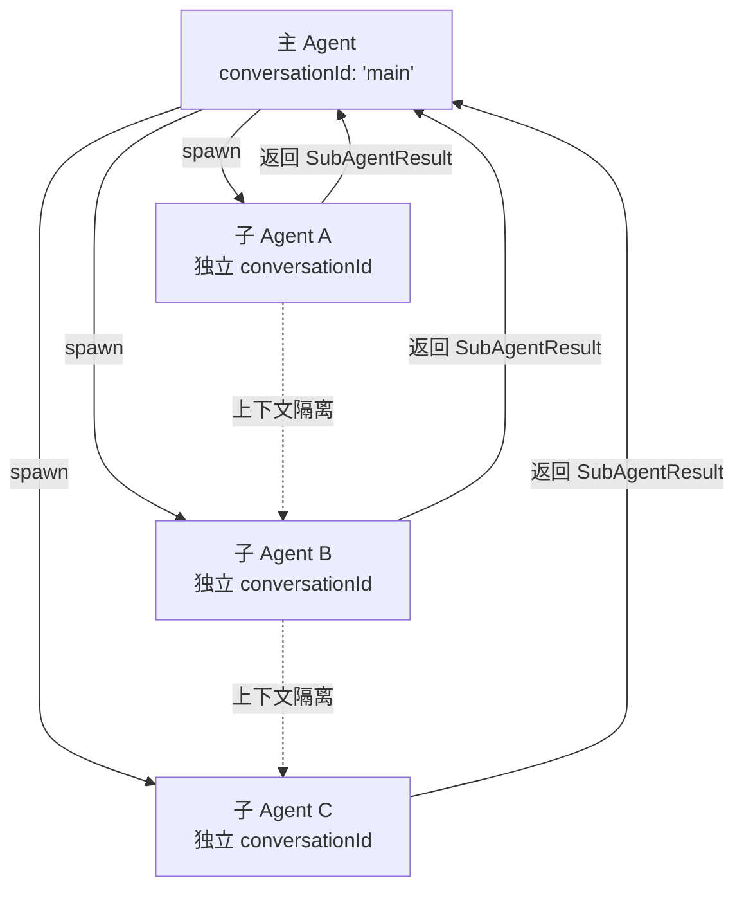

子 Agent 的关键设计决策：

- **上下文隔离**：每个子 Agent 使用 `"${sessionId}:${agentName}:${conversationId}"` 作为上下文键，确保 ToolSet 的状态不会跨子 Agent 污染
- **工具共享**：子 Agent 通过 `createSubAgentToolset` 创建，自动从主 Agent 获取可用工具列表
- **变量传递**：支持 `withVariables` 模式，主 Agent 的变量可以传递到子 Agent 中
- **状态快照**：子 Agent 的会话状态独立序列化，支持持久化和恢复

这在复杂任务场景中非常关键——例如，"分析一个代码仓库"可能需要：子 Agent A 负责搜索文件，子 Agent B 负责阅读和理解代码，子 Agent C 负责生成分析报告，而主 Agent 负责协调和汇总。

---

# 六、流式响应与增量渲染

AgentOS 的流式响应引擎是"操作系统响应性"的关键体现。它不等待 AI 模型完整回复后再渲染，而是以 Chunk 为单位增量推送：

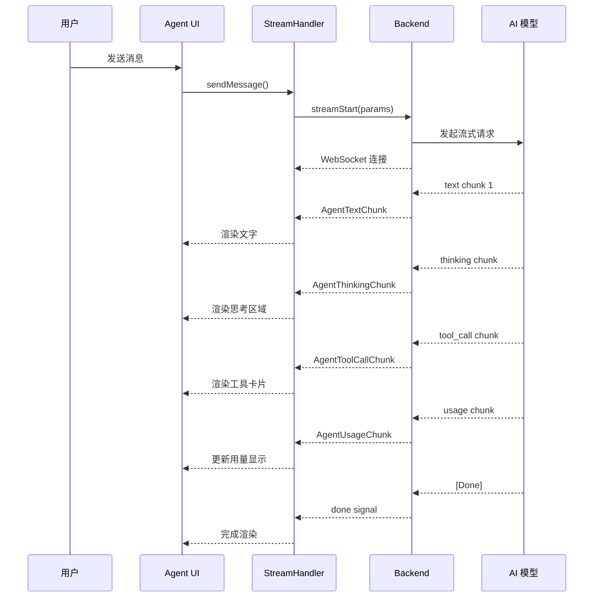

这种设计的用户体验价值在于——用户在看到第一个字的同时，思考过程和工具调用也已经在展示中。等待的体感被拆解为可感知的"进度"。

---

# 七、平台运行模式

AgentOS 支持两种运行模式，覆盖从开发调试到生产部署的完整场景：

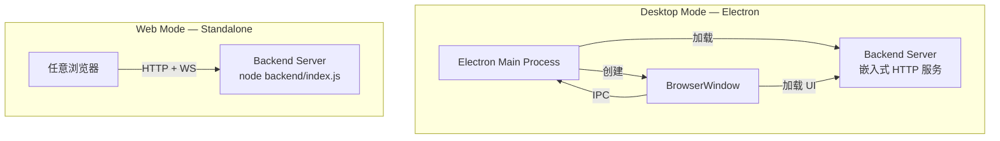

桌面模式下，后端服务器嵌入 Electron 主进程，通过 IPC 进行进程内高速通信。Web 模式下，后端作为独立 HTTP 服务器运行，支持任意浏览器远程连接。两者共享完全相同的后端代码和应用逻辑。

---

# 八、技术特性总结

| 特性 | 说明 |
|------|------|
| **类型安全** | 全部接口通过 TypeScript 严格类型定义，Zod Schema 运行时校验工具参数 |
| **插件沙箱** | UI 插件运行在隔离 iframe 中，Agent 插件运行在受限沙箱中，确保故障隔离 |
| **热插拔** | 插件支持运行时激活/停用/启用/禁用/安装/卸载，无需重启平台 |
| **多供应商** | 内置 OpenAI、Anthropic、Google Gemini 适配器，支持自定义端点接入 |
| **流式优先** | 原生支持流式对话，Chunk 级别增量渲染，支持中途停止 |
| **会话持久化** | 完整会话历史的序列化/反序列化，支持关闭后恢复 |
| **子 Agent** | 主 Agent 可派生多个子 Agent，各自拥有独立上下文和工具集 |
| **插槽扩展** | 8 种预定义 UI 注入点，插件可按需声明和渲染自定义界面 |
| **双模传输** | 自动适配 HTTP/WebSocket（Web 模式）和 Electron IPC（桌面模式） |
| **服务注册** | 插件间通过 PluginServiceRegistry 进行服务发现和调用 |
| **配置管理** | 每个插件独立声明配置 Schema，平台统一管理配置值的读写和变更通知 |

---

# 九、架构全景图

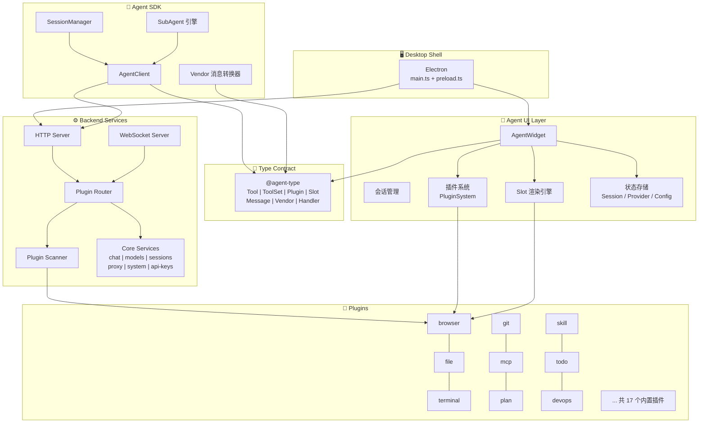

---

AgentOS 的设计哲学可以这样总结：**操作系统的核心价值不在于它能做什么，而在于它如何让其他人更容易地做他们想做的事**。AgentOS 所做的，就是为 AI Agent 提供这样一层——让工具开发者专注于工具的能力本身，让插件开发者专注于领域知识的封装，让用户专注于与 AI 的对话——平台的复杂度被吸收在这三层架构和十七个内置插件之中。
