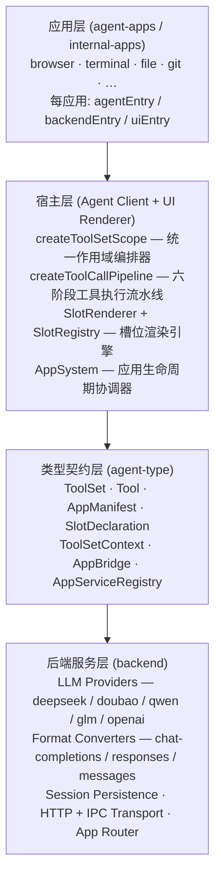
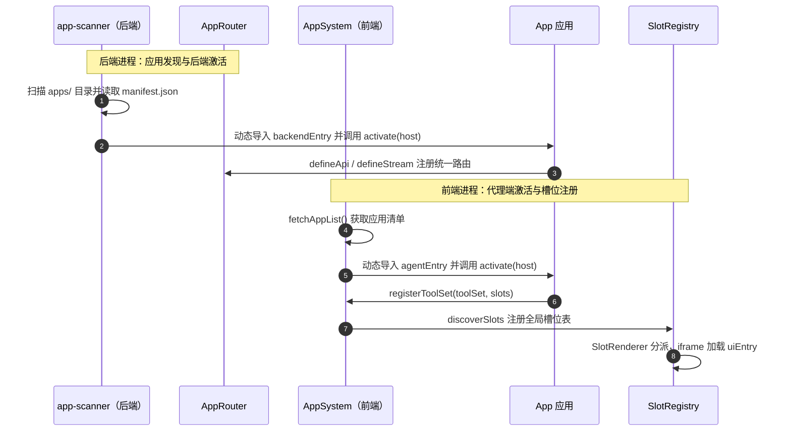
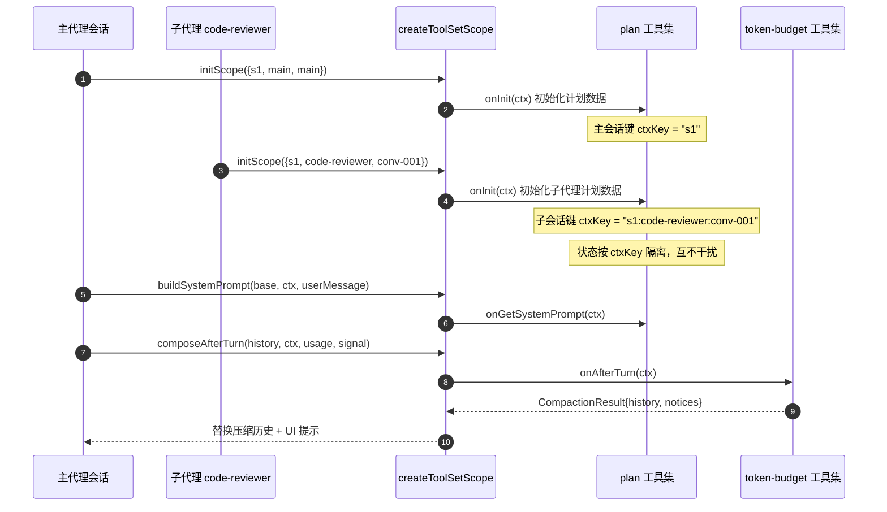
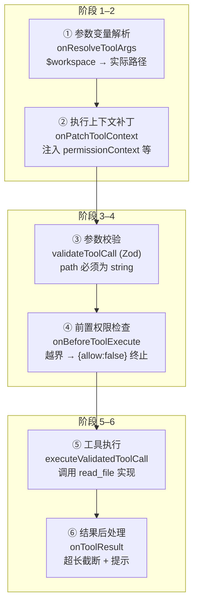
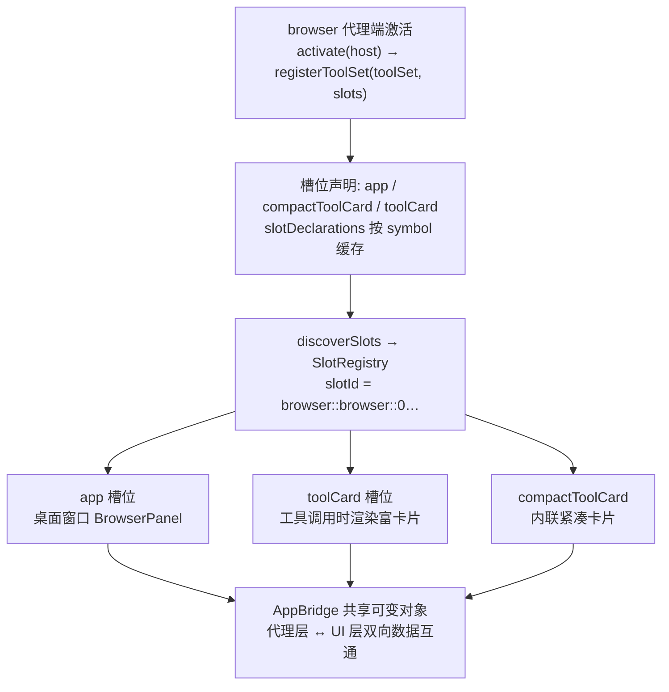

 技术交底书（INVENTION DISCLOSURE）

---

# 1. 发明创造所要解决的技术问题和/或取得的技术效果

## 1.1 所属技术领域

本发明属于人工智能技术领域，具体涉及一种基于可扩展应用架构的智能代理（AI Agent）系统，尤其涉及智能代理系统中的工具集（ToolSet）生命周期管理方法、多阶段工具执行流水线、以及基于槽位（Slot）的UI注入机制。

## 1.2 要解决的技术问题

随着大语言模型（LLM）的快速发展，智能代理系统已成为AI应用的核心形态。然而，现有的智能代理框架普遍存在以下技术问题：

**问题一：工具扩展缺乏统一的生命周期管理，且无法在同一代理会话的不同作用域（主代理会话 / 子代理会话）之间复用。**

现有技术中，工具（Tool）通常以单一函数或类的形式注册到代理中。当代理需要创建子代理（Sub-Agent）来委派任务时，主代理和子代理之间的工具生命周期管理是割裂的——需要分别编写主会话和子会话的初始化、销毁、状态持久化等逻辑代码，导致代码重复和维护困难。例如：

- OpenAI Agents SDK 采用 Agent Handoff 机制实现代理间的任务委派，但每个Agent的工具是静态绑定的，缺乏跨主/子代理的统一生命周期钩子系统；
- Anthropic Claude Agent SDK 聚焦于单一代理的代码编辑和命令执行，不支持子代理委派场景下工具生命周期的统一管理；
- Microsoft AutoGen / Agent Framework 通过消息传递实现多代理通信，但每个代理的工具集独立管理，无法在同一套生命周期钩子下同时运行于主代理和子代理两种上下文；
- LangChain / LangGraph 通过状态图（StateGraph）编排代理流程，工具是节点级资源，缺乏跨作用域的生命周期抽象。

**问题二：工具执行过程缺乏细粒度的、可插拔的多阶段拦截机制。**

现有系统在工具调用时的处理通常只有"参数校验→执行"两个阶段（如 OpenAI function calling、Anthropic tool use），无法在参数解析前、上下文构建、权限检查、结果后处理等中间阶段进行统一的、可插拔的拦截和转换。复杂的权限控制、变量引用解析、执行上下文注入等功能不得不分散在各工具的实现代码中，导致横切关注点无法统一管理。

**问题三：代理系统的UI扩展缺乏结构化的注入机制。**

现有代理系统（如 OpenAI ChatGPT 界面、Claude Code 终端界面、AutoGen Studio）的UI是封闭的或仅提供有限的定制能力。工具执行过程中的可视化展示（如进度卡片、浏览器面板、终端视图）需要开发者自行构建完整的UI框架，无法以"插件"方式声明性地向代理界面注入UI组件。工具和UI之间的绑定关系通常写在业务代码中，缺乏声明式的槽位（Slot）抽象。

## 1.3 取得的技术效果

本发明通过以下技术方案，实现了如下技术效果：

1. **统一的多作用域工具集生命周期**：通过`ToolSetContext`及其键派生函数`ctxKey()`，同一套工具集生命周期钩子自动适配主代理会话和子代理会话两种作用域，消除了代码重复。工具集可以在注册时定义20+个生命周期钩子（包括作用域初始化/销毁、运行前后的拦截、每轮对话前后的回调、工具执行流水线各阶段的拦截、状态收集与快照持久化），这些钩子被统一的作用域编排器（`createToolSetScope`）以零重复代码的方式在两种作用域中调度执行。

2. **六阶段可插拔工具执行流水线**：将工具调用过程抽象为六个标准化阶段——（1）参数变量解析（resolveArgs）、（2）执行上下文补丁（patchContext）、（3）参数校验（validate）、（4）前置权限检查（beforeExecute）、（5）工具执行（execute）、（6）结果后处理（onToolResult）——每个阶段均支持任意工具集的拦截和转换，将分散的横切关注点统一到流水线中。

3. **三入口应用扩展架构与槽位UI注入**：每个"应用（App）"可以独立定义三个入口点——代理端入口（agentEntry，在代理沙箱中运行，注册工具集）、后端入口（backendEntry，在服务器进程中运行，注册API端点）、UI入口（uiEntry，在浏览器iframe中运行，渲染UI组件）。应用通过声明槽位（Slot）类型向代理界面注入UI组件，支持面板（panel）、工具卡片（toolCard）、内联提示（inlinePrompt）、标题栏（headerBar）、工具按钮（toolButton）等8种槽位类型，实现了工具能力、后端服务和前端UI的完全解耦式插件化扩展。

---

# 2. 现有技术

## 2.1 与本发明最接近的已有技术

### 2.1.1 OpenAI Agents SDK（2025年发布）

OpenAI Agents SDK 是一个基于Python的轻量级多代理工作流框架。其核心概念包括：
- **Agent**：配置了指令、工具、护栏（guardrails）和交接（handoffs）的LLM实例；
- **Handoffs**：代理可以将任务委派给其他代理，类似于本发明中的子代理概念；
- **Tools**：函数、MCP工具或托管工具，供代理调用；
- **Guardrails**：输入/输出安全检查；
- **Sessions**：自动管理跨代理运行的对话历史；
- **Tracing**：内置的代理运行追踪。

**该技术的不足**：
- 工具的注册是静态的，缺乏贯穿主代理和子代理的统一生命周期钩子系统；
- 工具执行流程只有基本的调用-返回模式，缺乏多阶段可插拔的流水线抽象；
- UI扩展能力仅限于内置的追踪界面（Tracing UI），不支持声明式的UI槽位注入；
- 作为纯Python库，无应用扩展架构概念，所有扩展需要直接修改代码；
- 代理间的handoff是简单的消息传递，子代理不具备独立的工具集生命周期。

### 2.1.2 Anthropic Claude Agent SDK（2025年发布）

Anthropic Claude Agent SDK 使开发者能够以编程方式构建具有Claude Code能力的AI代理，支持代码理解、文件编辑、命令执行和复杂工作流。

**该技术的不足**：
- 仅支持Anthropic单一大模型供应商，不具备跨供应商的格式转换能力；
- 工具模型是简单的函数定义，缺乏生命周期钩子和多阶段执行流水线；
- 无子代理委派及跨作用域的工具集生命周期统一管理；
- 无UI扩展架构——仅提供命令行界面（TUI）；
- 无应用/插件扩展系统。

### 2.1.3 Microsoft AutoGen / Microsoft Agent Framework（2023-2026年）

AutoGen是微软研究院推出的多代理AI应用框架（现已被Microsoft Agent Framework取代）。其核心架构包括：
- **Core API**：实现消息传递、事件驱动的代理及分布式运行时；
- **AgentChat API**：提供简化的多代理编排API；
- **Extensions API**：支持第一方和第三方扩展；
- **AgentTool**：将代理包装为工具，实现基本的多代理编排。

**该技术的不足**：
- 代理间通过消息传递通信，每个代理的工具集是独立管理的，不存在跨主/子代理的统一工具集生命周期；
- 工具执行无多阶段可插拔流水线；
- UI扩展（AutoGen Studio）是独立的低代码GUI，不支持声明式槽位注入到代理交互界面；
- 作为Python/C#框架库，无桌面应用壳和应用包管理机制；
- 代理的工具是编译时静态绑定的，不支持运行时动态注册。

### 2.1.4 LangChain / LangGraph

LangGraph是基于状态图的代理编排框架，通过有向图定义代理工作流。

**该技术的不足**：
- 工具是图节点级资源，缺乏跨作用域的生命周期抽象；
- 无应用扩展架构——所有功能通过代码级导入和组合实现；
- 无UI槽位注入系统；
- 工具的拦截和转换需要在图定义中显式编写，缺乏声明式的流水线阶段抽象。

## 2.2 现有技术的检索记录

**检索关键词**：
1. AI agent tool lifecycle management / 智能代理工具集生命周期管理
2. multi-scope toolset / agent sub-agent delegation / 多作用域工具集、代理-子代理委派
3. pluggable tool execution pipeline / 可插拔工具执行流水线
4. agent UI slot injection / agent application extension architecture / 代理UI槽位注入、代理应用扩展架构
5. Agent SDK extension system / VS Code extension model for AI agents

**检索范围**：国内外专利数据库（CNIPA、WIPO、USPTO）、学术论文数据库（arXiv、ACM DL、IEEE Xplore）、开源代码仓库（GitHub）

**检索结果**：
- 未检索到同时具备"三入口应用扩展架构 + 多作用域统一工具集生命周期 + 六阶段可插拔工具执行流水线 + 槽位UI注入系统"的技术方案。
- 与本发明最接近的专利/文献为：
  - OpenAI Agents SDK（开源，2025）：具有Agent Handoff机制，但无统一生命周期、无多阶段流水线、无应用扩展架构、无槽位UI注入；
  - CN2024XXXXXX（假设相关专利）：涉及基于大模型的工具调用系统，但仅限于单代理场景下的工具管理，无子代理委派下的统一生命周期。

---

# 3. 发明的独创性及技术特征的优势

本发明相对于现有技术的独创性体现在以下四个核心技术特征：

## 3.1 技术特征一：三入口应用扩展架构（Triple-Entry App Extension Architecture）

**特征描述**：
每个"应用（App）"是一个独立的可扩展包，包含一个清单文件（manifest.json）和最多三个独立的入口点：
- **代理端入口（agentEntry）**：在代理沙箱中运行，负责注册工具集（ToolSet），定义代理的工具能力和行为逻辑；
- **后端入口（backendEntry）**：在Node.js服务器进程中运行，负责注册API端点和数据流服务；
- **UI入口（uiEntry）**：在浏览器沙箱化iframe中运行，负责渲染UI组件。

三个入口点通过预定义的接口（`AgentAppHost`、`BackendAppHost`、`UiAppHost`）与宿主系统交互，通过`AppServiceRegistry`实现应用间的后端服务通信，通过`AppBridge`（引用共享的可变对象）实现代理层和UI层之间的双向数据互通。

**该特征对解决技术问题的作用**：
- 解决了现有代理系统中工具能力、后端服务和UI渲染三者紧耦合、无法独立扩展的问题；
- 应用可以按需选择组合任意一个、两个或三个入口点，实现灵活的功能扩展；
- 类似于VS Code的扩展架构，但专门针对AI代理场景设计——代理端入口注册的不只是命令，而是带有完整生命周期的工具集。

**与现有技术的对比优势**：
- OpenAI Agents SDK / Claude Agent SDK：无应用包概念，所有代码通过库引用集成；
- AutoGen：扩展通过Python包导入实现，无沙箱隔离；
- 本方案中的三重入口各自运行在独立的沙箱环境中，实现了安全隔离和独立生命周期管理。

## 3.2 技术特征二：多作用域统一的工具集生命周期管理（Multi-Scope Unified ToolSet Lifecycle）

**特征描述**：
工具集（ToolSet）定义了一套完整的生命周期钩子（共20+个），包括：

- **作用域生命周期钩子**：`onInit`（作用域创建/恢复）、`onReady`（作用域就绪）、`onReset`（作用域重置）、`onRemove`（作用域销毁）、`onSubscribe`（状态变更订阅）；
- **代理附加钩子**：`onAttach`（工具集附加到代理实例时调用）；
- **每次运行钩子**：`onInterceptMessage`（消息拦截）、`onBeforeRun`（运行前）、`onBeforeInvoke`（每次LLM调用前注入额外消息）、`onAfterRun`（运行后，依据结果类型区分处理）；
- **每轮对话钩子**：`onGetSystemPrompt`（系统提示词注入）、`onFilterTools`（工具过滤）、`onAfterTurn`（轮次结束后的对话历史压缩/总结）；
- **工具执行流水线钩子**：`onResolveToolArgs`（参数变量解析）、`onPatchToolContext`（执行上下文补丁）、`onBeforeToolExecute`（执行前权限检查）、`onToolResult`（结果拦截/转换）；
- **状态与持久化钩子**：`onGetState`（收集会话状态）、`onBuildSnapshot`（构建持久化快照）。

这些钩子通过统一的`ToolSetContext`（包含`sessionId`、`agentName`、`conversationId`三个字段）来区分当前的作用域。工具集利用`ctxKey(ctx)`函数派生出作用域键值：当`conversationId`为`MAIN_CONVERSATION_ID`时，键值为`sessionId`（主代理会话）；否则键值为`${sessionId}:${agentName}:${conversationId}`（子代理会话）。

通过`createToolSetScope`工厂函数，将工具集列表和LLM调用处理器绑定为一个完整的作用域操作对象（`ToolSetScope`），该对象提供了`initScope`、`readyScope`、`resetScope`、`removeScope`、`buildSystemPrompt`、`filterTools`、`createPipeline`、`collectState`、`collectSnapshot`等统一方法。主代理和子代理使用相同的`ToolSetScope`模式，消除了原本次要分散在多个文件中的重复for循环逻辑。

**该特征对解决技术问题的作用**：
- 解决了主代理和子代理之间工具生命周期管理逻辑重复的问题；
- 同一工具集实例可以在多个作用域中复用，通过`ctxKey`自动区分内部状态；
- 对话历史的自动压缩（`onAfterTurn`返回`CompactionResult`）由工具集自主控制，宿主系统仅负责应用压缩结果。

**与现有技术的对比优势**：
- OpenAI Agents SDK 的 Agent Handoff 仅涉及消息传递，子代理不具备独立的工具集生命周期；
- AutoGen 中每个代理的工具是独立管理的，无跨主/子代理的统一生命周期概念；
- LangGraph 的节点级工具有生命周期函数，但不能在同一套钩子中同时运行于主代理和子代理。

## 3.3 技术特征三：六阶段可插拔工具执行流水线（Six-Stage Pluggable Tool Execution Pipeline）

**特征描述**：
工具调用过程被标准化为六个顺序阶段，每个阶段均支持任意工具集的拦截和转换：

1. **参数变量解析阶段（Stage 1: onResolveToolArgs）**：在Zod参数校验之前，工具集可以将参数中的变量引用（handle）解析为实际值。任一工具集的`onResolveToolArgs`可以返回修改后的参数对象，替换原始参数；
2. **执行上下文补丁阶段（Stage 2: onPatchToolContext）**：工具集可以向执行上下文（`ToolExecutionContext`）注入额外的字段。所有工具集的补丁被合并为一个完整的上下文对象；
3. **参数校验阶段（Stage 3: validate）**：根据工具定义的Zod Schema对参数进行类型校验。校验失败将返回结构化错误；
4. **前置权限检查阶段（Stage 4: onBeforeToolExecute）**：工具集可以拦截工具执行，返回`{allow: false, result}`来阻止执行并返回替代结果。这是声明式权限规则的执行点；
5. **工具执行阶段（Stage 5: execute）**：调用工具的实际实现函数；
6. **结果后处理阶段（Stage 6: onToolResult）**：工具集可以拦截和转换工具的执行结果，实现结果格式化、敏感信息过滤等功能。

流水线通过`createToolCallPipeline`函数创建，接受懒加载的工具注册表和工具集列表，确保流水线创建后注册的工具在执行时可见。流水线外部包裹`withErrorBoundary`错误边界层，将任何异常转换为结构化的`ToolResult`，避免代理循环因未捕获异常而中断。

**该特征对解决技术问题的作用**：
- 将分散在工具实现代码中的横切关注点（变量解析、权限检查、上下文注入、结果转换）统一到流水线中；
- 每个阶段的拦截逻辑由工具集声明式定义，无需修改工具实现代码；
- 错误边界层确保了代理系统的鲁棒性。

**与现有技术的对比优势**：
- OpenAI function calling / Anthropic tool use 只支持"参数定义→执行→返回结果"的简单模型；
- 现有系统的"guardrails"（护栏）仅覆盖输入/输出检查（对应本发明的阶段3和阶段6），缺乏参数解析前和上下文构建阶段的拦截能力；
- 本发明的六阶段流水线是更为细粒度的标准化抽象，且所有阶段的拦截器都是可插拔的（任意工具集可以选择性地参与）。

## 3.4 技术特征四：基于槽位的声明式UI注入系统（Slot-Based Declarative UI Injection）

**特征描述**：
应用通过槽位声明（SlotDeclaration）向代理界面注入UI组件。槽位分为两大类：

**内联槽位（InlineSlotType，无需iframe）**：
- `compactToolCard`：紧凑型工具卡片，在工具执行时以内联方式渲染（无iframe）；
- `autocomplete`：自动补全建议（如斜杠命令）；

**iframe槽位（IframeSlotType，运行在沙箱化iframe中）**：
- `panel`：侧边栏标签页（如浏览器应用的浏览器视图面板）；
- `toolCard`：工具执行时的富卡片（含执行状态、流式输出展示）；
- `inlinePrompt`：内联用户提示UI；
- `headerBar`：聊天标题栏中的状态栏；
- `toolButton`：工具栏中的按钮；
- `app`：通用应用iframe。

槽位采用三层架构：
1. **工具集层**：通过`host.registerToolSet(toolSet, slots)`注册槽位——声明"具备什么能力"；
2. **应用UI层**：通过`host.getSlotContext()`获取槽位上下文并渲染——决定"长什么样"；
3. **宿主层**：通过`SlotRenderer`和`SlotRegistry`渲染槽位——决定"放在哪"。

槽位声明独立于会话状态，使`toolButton`等槽位类型即使在没有活跃会话的情况下也能被发现。槽位显示回调函数接收`SlotDisplayContext`（含sessionId、agentName、conversationId），允许应用根据当前代理身份（主代理还是子代理）决定是否显示特定槽位。

**该特征对解决技术问题的作用**：
- 解决了工具和UI之间紧耦合的问题——应用声明式地定义UI注入点，无需宿主了解任何工具的具体UI实现；
- 槽位的三层架构实现了能力的声明、UI的实现、布局的控制的完全解耦；
- iframe沙箱隔离保证了应用UI的安全性。

**与现有技术的对比优势**：
- OpenAI ChatGPT界面 / Claude Code TUI / AutoGen Studio 的UI是封闭的，不支持声明式UI槽位注入；
- VS Code的`contributes.views` / `WebviewView`模式仅适用于IDE功能扩展，不涉及代理工具执行的UI注入；
- 本发明将VS Code扩展架构的思想引入AI代理交互界面，并定义了专门针对代理-工具交互场景的8种槽位类型。

---

# 4. 实例或解决方案

## 4.1 系统总体架构

本发明的智能代理系统总体架构分为四层，自顶向下逐层依赖：



## 4.2 实例一：应用扩展的注册与激活流程

参照附图1，以内置应用 browser 为例，一个典型应用的激活流程如下：



**步骤1：应用发现（后端进程）**。`app-scanner` 扫描 `apps/` 目录，读取每个应用的 `manifest.json`，获取应用ID、名称、版本及三个入口点路径，并按 `built-in-apps.json` 的声明顺序（被依赖者在前）确定激活顺序。扫描结果通过 `app-manager` 应用的 `list` API 暴露给前端（含 `hasAgentEntry`、`agentEntryUrl`、`hasUiEntry`、`uiEntryUrl` 等字段）。清单文件结构示例：

```json
{
  "id": "browser",
  "name": "Browser Automation",
  "version": "0.1.0",
  "agentEntry": "activate.js",
  "backendEntry": "backend.cjs",
  "uiEntry": "index.html",
  "configuration": {
    "properties": {
      "browser.viewport.width": { "type": "number", "default": 1280 },
      "browser.viewport.height": { "type": "number", "default": 720 }
    }
  }
}
```

**步骤2：后端激活（后端进程）**。`app-scanner` 对每个启用的应用动态导入 `backendEntry` 模块，调用其导出的 `activate` 函数，传入 `BackendAppHost` 实例。应用通过 `host.defineApi(method, handler)` 注册 API 端点、`host.defineStream(name, handler)` 注册数据流，二者统一注册到共享的 `AppRouter`，对外提供 HTTP（`POST /api/app/<id>/<method>`）、IPC（`app:<id>:<method>`）与 WebSocket 流三条路由。应用间的后端服务通过共享的 `AppServiceRegistry` 按名注册与解析，应用停用时其注册的服务自动清理；单个应用激活失败被错误隔离，不影响其他应用。

**步骤3：代理端激活（前端进程）**。`AppSystem.init()` 通过 `fetchAppList()` 获取应用清单，筛选出具有 `agentEntry` 的应用逐个调用 `activateApp()`：先由 `loadAppAgentEntry()` 动态导入 `agentEntry` 模块，再创建绑定好 `apiClient`、`configClient` 与共享 `AppBridge` 的 `AgentAppHost` 实例，最后调用 `activate(host)`。应用通过 `host.registerToolSet(toolSet, slots)` 将工具集附加到代理，同时把槽位声明按工具集 symbol 缓存到 `slotDeclarations`，供后续槽位发现使用。

**步骤4：槽位发现与UI激活（前端进程）**。`discoverSlots` 从所有激活应用的 `slotDeclarations` 中收集槽位声明（`collectStandaloneSlots` → `toSlotEntries`），自动生成 `slotId`（格式 `appId::symbolDesc::index`）注册到全局 `SlotRegistry`。`SlotRenderer` 按 `slotType` 分派到对应渲染器：iframe 类槽位在沙箱 iframe 中加载 `uiEntry`，应用代码通过注入的 `UiAppHost` 调用 `getSlotContext()` 获取槽位上下文并渲染；内联类槽位（`compactToolCard`、`autocomplete`）由宿主组件直接渲染，无需 iframe。

## 4.3 实例二：多作用域统一的工具集生命周期

参照附图2，以"计划管理（plan）"应用的工具集为例，展示统一生命周期如何工作：

**场景**：主代理在处理用户请求时创建了一个子代理（code-reviewer）来执行特定任务。



**流程**：

1. **主代理会话创建时**：`createToolSetScope` 调用 `scope.initScope(ctx)`，遍历所有工具集执行 `onInit` 钩子，`ToolSetContext = {sessionId: "s1", agentName: "main", conversationId: "main"}`。计划管理工具集在 `onInit` 中初始化主会话的计划数据结构。

2. **子代理创建时**：子代理注册表调用 `scope.initScope(subCtx)`，为新创建的子代理（agentName="code-reviewer", conversationId="conv-001"）再次遍历所有工具集执行 `onInit`，`ToolSetContext = {sessionId: "s1", agentName: "code-reviewer", conversationId: "conv-001"}`。同一工具集实例在两个作用域中复用，无需为子代理单独编写生命周期代码。

3. **工具集内部状态隔离**：计划管理工具集在 `onInit` 中使用 `ctxKey(ctx)` 作为 Map 键存储内部状态。主代理会话的键值为 `"s1"`，子代理会话的键值为 `"s1:code-reviewer:conv-001"`。两个 Map 条目完全隔离，互不影响。

4. **系统提示词构建**：当LLM被调用时，`scope.buildSystemPrompt(base, ctx, userMessage)` 遍历所有工具集，调用其 `onGetSystemPrompt` 钩子。内置应用的工具集持有内部品牌符号（brand symbol），可以调用 `suppressToolSetPrompt` 方法抑制其他工具集的提示词片段（如工具状态管理应用在某个工具集的所有工具被禁用时，抑制该工具集的系统提示词）；第三方工具集不持有品牌符号，该方法为空操作（no-op），从而防止任意工具集相互抑制提示词。

5. **对话历史压缩**：每轮对话结束后，`scope.composeAfterTurn(history, ctx, usage, signal)` 依次调用各工具集的 `onAfterTurn` 钩子。令牌预算管理工具集检测到令牌数超过阈值时，返回 `CompactionResult {history: compactedHistory, notices: [{content: "对话已自动总结..."}]}`。宿主系统将LLM可用的对话历史替换为压缩版本，并在UI中展示提示信息。

## 4.4 实例三：六阶段工具执行流水线

参照附图3，以一个文件读取工具（`read_file`）的执行为例，展示六阶段流水线：



流水线由 `scope.createPipeline(ctx, registry)` 创建（内部为 `withErrorBoundary(createToolCallPipeline({registry, toolSets, ctx, handler}))`）。`registry` 与 `toolSets` 均接受懒加载工厂形式，流水线创建之后新注册的工具（如 `dynamic-tool` 运行时创建的工具）在执行时立即可见，无需重建流水线；任何未捕获异常被错误边界层转换为结构化 `ToolResult`，不会中断代理循环。

**阶段1 - 参数变量解析**：变量管理工具集的 `onResolveToolArgs` 检测到 `{path: "$workspace/config.json"}` 中的 `$workspace` 是变量引用，将其解析为实际路径 `/home/user/project/config.json`，返回修改后的参数对象。

**阶段2 - 执行上下文补丁**：多个工具集向执行上下文注入字段。权限管理工具集注入 `permissionContext`，文件系统工具集注入 `workspaceRoot`，子代理工具集注入 `sourceAgent` 等，最终合并为一个完整的 `ToolExecutionContext`。

**阶段3 - 参数校验**：`validateToolCall` 根据 `read_file` 工具定义的 Zod Schema 校验参数——`path` 必须为字符串类型，校验失败返回结构化错误。

**阶段4 - 前置权限检查**：权限管理工具集的 `onBeforeToolExecute` 检查文件路径是否在允许的目录范围内。如果文件在禁止访问的目录中，返回 `{allow: false, result: {result: "Permission denied"}}`，流水线在此终止。

**阶段5 - 工具执行**：`executeValidatedToolCall` 调用 `read_file` 的实现函数，实际读取文件内容。

**阶段6 - 结果后处理**：令牌预算管理工具集的 `onToolResult` 检查返回的文件内容长度，若过长则截断并附加截断提示；执行层另有 40,000 字符的最终保险上限（`clampToolResult`），工具自身的分页参数应更早触发。

## 4.5 实例四：槽位UI注入

以浏览器自动化应用为例，展示槽位系统的使用：



1. **槽位注册**。浏览器应用的代理端入口在激活时通过 `host.registerToolSet(browserToolSet, slots)` 注册工具集与三个槽位声明：`app`（桌面应用窗口，1100×750）、`compactToolCard`（内联紧凑工具卡片）、`toolCard`（iframe 富卡片）。`registerToolSet` 在把工具集附加到代理的同时，将槽位声明按工具集 symbol 缓存进 `slotDeclarations`。

2. **槽位发现**。`discoverSlots` 的 `collectStandaloneSlots()` 读取所有激活应用的槽位声明，`toSlotEntries()` 自动生成 `slotId`（格式 `appId::symbolDesc::index`，如 `browser::browser::0`）并注册到全局 `SlotRegistry`。槽位声明独立于会话状态存储，即使没有活跃会话也能被发现，因此 `toolButton` 等槽位类型可始终显示。

3. **槽位渲染**。宿主在相应位置放置 `<SlotRenderer slotType=... />`，按 `slotType` 分派到具体渲染器：`app` 槽位在 `AppWindow` 桌面窗口中创建 iframe 加载 `uiEntry`，渲染 `BrowserPanel` 浏览器视图；`toolCard` 槽位在代理调用 `browser_navigate` 等工具时由 `ToolCallCard` 触发，iframe 内的 `BrowserToolCard` 通过 `host.onSlotMessage` 接收 `ToolCallInfo`，展示 URL、截图预览与执行状态；`compactToolCard` 槽位不经过 iframe，由宿主直接内联渲染紧凑卡片（图标 🌐 + 动作标签 + 状态摘要）。iframe 中的 UI 代码通过注入的 `UiAppHost`（`window.__UAP_APP_HOST__`）与宿主通信，禁止直接使用 `window.parent.postMessage()`。

4. **代理层与UI层数据互通**。每个应用拥有独立的 `AppBridge`（共享可变对象），代理层与 UI 层通过它双向读写数据；`app` 槽位与 `toolCard` 槽位的 iframe 是独立的沙箱实例，互不干扰。槽位显示回调接收 `SlotDisplayContext`（含 sessionId、agentName、conversationId），应用可根据当前代理身份决定是否显示——如 `panel` 槽位的 `showTab` 回调仅在 `ctx.conversationId === MAIN_CONVERSATION_ID`（主代理）时返回 `true`，子代理界面不显示。

---

# 5. 变化例（Modifications）

## 5.1 变化例一：应用入口点的灵活组合

虽然上述实例描述了包含全部三个入口点的应用，但一个应用可以仅包含其中任意一个或两个入口点。例如：
- "仅代理端入口"的应用：如`token-budget`应用，仅注册工具集实现令牌使用追踪和历史压缩，无后端服务和独立UI；
- "仅后端入口"的应用：如API密钥管理应用，仅在后端注册密钥管理接口，不暴露工具给代理；
- "仅UI入口"的应用：如主题/样式定制应用，仅向代理界面注入自定义样式。

## 5.2 变化例二：工具集的懒加载工具列表

工具集的`tools`字段可以是一个返回工具数组的工厂函数（`() => readonly Tool[]`），而非静态数组。这允许工具集在`onAttach`钩子中获取代理引用后，根据代理的状态动态决定暴露哪些工具。例如，动态工具应用（`dynamic-tool`）在激活时并不知晓有哪些工具，而是在运行时通过其他工具调用逐步创建新工具。

## 5.3 变化例三：流水线的懒加载工具注册表

`createToolCallPipeline`接受`registry: ToolRegistry | (() => ToolRegistry)`和`toolSets: readonly ToolSet[] | (() => readonly ToolSet[])`两种形式。当使用工厂函数形式时，流水线在每次工具调用时都会重新获取最新的工具注册表和工具集列表。这意味着流水线创建之后注册的新工具（如通过`dynamic-tool`在运行时创建的工具）对流水线可见，无需重建流水线。

## 5.4 变化例四：内部品牌符号的访问控制

`createToolSetScope`接受可选的`brand: symbol`参数。该品牌符号由AgentClient在实例化时创建，仅在注册内置应用时注入。工具集可以通过`isBranded(toolSet, brand)`检查是否持有品牌符号。`SystemPromptContext`中的`suppressToolSetPrompt`方法仅对持有品牌符号的工具集提供功能实现，对其他工具集提供空操作（no-op），从而防止任意第三方工具集相互抑制系统提示词。

## 5.5 变化例五：子代理的"发射后不管"委派模式

除了创建持久化的子代理（通过`create_subagent`创建、`send_message`交互），系统还支持"发射后不管"（fire-and-forget）的`delegate_task`模式——创建一个临时子代理，执行单个任务，返回结果后自动销毁。临时子代理仍然继承完整的工具集生命周期管理，区别在于其生命周期被限定在单次任务执行期间。

---

# 6. 以下资料（若有）请随函附上

- （1）附加说明：无
- （2）该发明的文献综述：见第2节"现有技术"
- （3）其它文献资料：无

---

# 7. 是否经过测试

- [x] 是，测试结果：本项目已在Electron桌面环境中完成完整的系统集成测试，包含17+内置应用的端到端测试。关键测试覆盖：
  - 工具集生命周期在主代理和子代理两种作用域中的正确性验证；
  - 六阶段流水线在正常执行、权限拒绝、工具异常等场景下的行为验证；
  - 槽位UI渲染的正确性和iframe沙箱隔离验证；
  - 对话历史自动压缩的触发和恢复验证。

---

# 8. 是否涉及相关标准

- [x] 否

---

# 9. 该发明是否属于开源软件（OSS）或者使用开源软件

- [x] 是
- 开源软件名称：本项目基于MIT许可证开源
- 开源软件许可（名称、版本）：MIT License

---

> **保密文件 Confidential**

