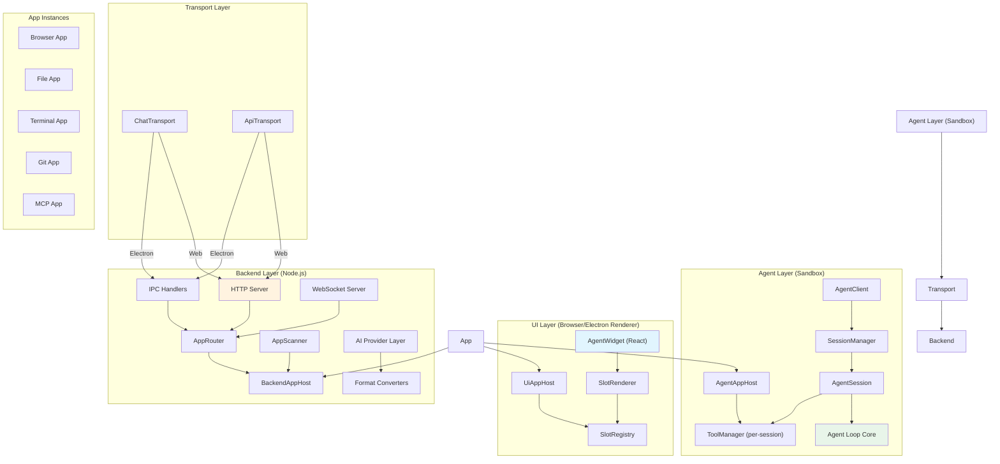

# 技术交底书
# INVENTION DISCLOSURE

**保密文件 Confidential!**

---

## 1. 发明创造所要解决的技术问题和/或取得的技术效果

*Which technical problem can be solved by this invention and/or what technical effect can be obtained?*

### 拟解决的技术问题

当前，大语言模型（LLM）驱动的AI代理（AI Agent）开发面临以下核心技术问题：

**问题一：代理框架与用户界面的紧耦合问题。** 现有AI代理框架（如LangChain、AutoGen、Semantic Kernel等）通常将代理逻辑与特定的前端渲染框架或部署环境深度绑定，导致同一个代理系统难以在不同运行环境（桌面Electron应用、Web浏览器、嵌入式组件）之间复用，开发者需要针对每种部署形态分别实现代理逻辑和UI层。

**问题二：插件系统缺乏跨层协同能力。** 现有代理框架的插件机制通常是单层扩展——要么只在后台扩展工具API，要么只在前端扩展UI组件。缺少一种统一的三层（代理沙箱层-Agent层、后台服务层-Backend层、前端UI层）插件架构，使插件能够同时在三层注入能力并保持跨层协同通信。

**问题三：工具生命周期管理缺失。** 现有框架对工具的注册和调用多为简单的"注册-调用"模式，缺乏贯穿会话完整生命周期的细粒度钩子系统（如会话初始化、每轮执行前后、工具调用前后、状态持久化等），导致有状态工具（如浏览器会话、终端进程、文件系统状态）无法在长时间运行的代理会话中保持一致性。

**问题四：流式响应格式碎片化。** 不同AI供应商（OpenAI、Anthropic、Google Gemini等）各自使用不同的流式响应格式，开发者需要为每个供应商编写独立的流解析逻辑，极大地增加了多供应商支持的复杂度。

**问题五：用户交互中断问题。** 在AI代理执行工具调用链过程中，当需要用户输入时（如确认操作、提供参数），现有框架缺乏一种支持"绑定模式"（暂停代理执行等待用户响应）和"分离模式"（立即返回但后续以用户消息注入）双模式的用户输入机制。

### 取得的技术效果

1. **运行环境无关性：** 通过双传输层自动适配（IPC/HTTP）和适配器模式，同一套代理逻辑和UI组件可零修改在Electron桌面应用、独立Web服务、嵌入式组件三种部署形态下运行。
2. **三层贯通的插件架构：** 每个插件可同时注册代理沙箱层的工具集（ToolSet）、后台服务层的API端点（defineApi/defineStream）、前端UI层的插槽渲染（Slot System），三层通过AppBridge实现类型安全的双向通信。
3. **完整会话生命周期的工具钩子系统：** 提供约20种细粒度生命周期钩子，覆盖从会话创建到销毁的完整链路，支持有状态工具的状态持久化、恢复和跨会话隔离。
4. **供应商无关的流式协议：** 通过AgentStreamChunk判别联合类型和format-converter抽象层，将任意供应商的流格式归一化为统一协议，上层代码零感知供应商差异。
5. **双模式用户输入机制：** bound/detached双模式兼顾同步等待和异步通知两种场景，结合ephemeral标记支持瞬时/持久请求的区分管理。

---

## 2. 现有技术

*How has this problem been solved up to now?*

*描述申请人所知的与发明方案最接近的已有技术，不是内部生产工艺，而是外部已知产品、工艺及布局。应包含相关文献材料，如：出版物、专利文件、手册、公司出版物等的描述。*

### 2.1 现有技术方案概述

**（1）LangChain / LangGraph（LangChain Inc.）**

LangChain是目前最流行的AI代理开发框架之一，提供工具调用（Tool Calling）、链式调用（Chains）、记忆管理（Memory）等核心能力。其LangGraph模块支持有状态的图结构代理编排。

不足：
- 代理逻辑深度绑定Python/JavaScript运行时，UI层需独立开发
- 插件机制（LangChain Tools）仅限于工具层面的单层扩展，缺乏跨层协同
- 无内置的双传输层适配机制（IPC/HTTP自动切换）
- 工具生命周期钩子较少（主要围绕工具调用前后的简单回调）
- 不同LLM供应商的流式响应需用户自行适配

**（2）Microsoft Semantic Kernel / AutoGen**

微软Semantic Kernel提供插件（App）架构和规划器（Planner），AutoGen提供多代理对话编排。

不足：
- 插件系统缺乏UI层的插槽注入机制（Slot System）
- 未提供完整的三层（Agent/Backend/UI）插件入口架构
- 部署形态单一，缺乏Electron与Web共用的统一SDK设计
- 工具状态管理缺乏完整的"初始化→运行→持久化→恢复→销毁"生命周期钩子链

**（3）VS Code Extension API**

VS Code的扩展系统（Extension API）提供了`contributes`声明式配置注册、`activate`/`deactivate`生命周期管理等。

不足：
- 仅适用于编辑器扩展场景，不具备AI代理的会话管理和工具调用能力
- 扩展之间的跨层数据共享需要通过多个API独立实现，缺乏统一的AppBridge机制
- 无内置的iframe沙箱UI插槽渲染系统

**（4）OpenAI Assistants API / Anthropic Tool Use**

云服务商提供的助理API和工具调用API。

不足：
- 为SaaS云端模式，无法在本地Electron/嵌入式场景中运行
- 不支持自定义插件扩展架构
- 流式格式各自独立，无统一抽象

### 2.2 现有技术文献检索

**检索关键词：**
- AI agent app architecture, multi-layer app system
- tool lifecycle hooks, session-aware tool management
- dual transport IPC HTTP agent SDK
- vendor-agnostic streaming protocol agent
- app slot system UI injection
- agent sandbox backend UI three-layer app
- Electron web unified agent framework

**检索结果：**
经检索，未发现同时具备以下所有特征的现有专利或公开文献：
1. 三层（Agent沙箱/Backend服务/UI前端）插件入口架构
2. 双传输层（IPC/HTTP）自动适配
3. 约20种细粒度工具会话生命周期钩子
4. 供应商无关的统一流式响应协议
5. 七种UI插槽类型（panel/toolCard/inlinePrompt/headerBar/toolButton/compactToolCard/autocomplete）的声明式注入系统

---

## 3. 发明的独创性及技术特征的优势

*What does the inventive step lie in and what advantages arise from the technical features?*

*解释发明的每个技术特征的优势，或每个技术特征对解决技术问题所起的作用。*

### 3.1 独创性总述

本发明的核心独创性在于：**构建了一套三层贯通、双传输适配、完整生命周期管控的AI代理SDK架构**，使AI代理系统能够在不同运行环境间零修改复用，同时允许插件在同一架构下实现三层协同扩展。

### 3.2 关键技术特征及其优势

**技术特征一：三层插件入口架构（Agent/Backend/UI Tri-Entry App）**

每个插件通过一份`manifest.json`声明至多三个入口点：
- `agentEntry`：在代理沙箱中运行，通过`AgentAppHost`注册工具集（ToolSet）
- `backendEntry`：在Node.js后台进程中运行，通过`BackendAppHost`注册API方法和流式端点
- `uiEntry`：在浏览器iframe沙箱中运行，通过`UiAppHost`获取插件状态和插槽上下文

**优势：** 一个插件即可贯通全栈。例如"浏览器自动化"插件的agentEntry注册浏览器操作工具，backendEntry管理Playwright浏览器进程，uiEntry渲染浏览器预览面板——三层协同实现完整的"AI操控浏览器"能力，无需分别开发三个独立模块。

---

**技术特征二：双传输层自动适配（Dual Transport Auto-Selection）**

系统在运行时检测运行环境（通过`IS_ELECTRON_IPC`标记），自动选择传输协议：
- Electron环境：使用IPC（Inter-Process Communication）通道，通过`electronAPI.invoke`调用
- Web环境：使用HTTP + SSE（Server-Sent Events），通过标准`fetch` API调用

每个后端服务提供两套适配器实现（Http* / Ipc*），工厂函数根据环境标记自动选择，上层业务代码完全感知不到传输层差异。

**优势：** 同一套代理逻辑可在Electron桌面应用和Web浏览器中零修改运行。开发者在Electron中调试完成后，无需任何代码变更即可发布为Web SaaS版本。

---

**技术特征三：完整会话生命周期的工具钩子系统**

提供按固定顺序触发的约20种生命周期钩子：

```
onAttach（插件附加）
  → onInitSession → onSessionReady（会话创建/恢复）
    → onBeforeRun（每轮sendMessage开始）
      → onGetSystemPrompt → onFilterTools → onBeforeInvoke
        → onBeforeToolCall → execute → onAfterToolCall
      → onAfterTurn（Token追踪、历史压缩）
    → onAfterRun（每轮结束）
    → onGetState（状态持久化）
  → onResetSession / onRemoveSession（清理）
onPatchToolContext（每次工具调用前修补上下文）
```

子代理对话还拥有并行的`onInitConversation` / `onResetConversation` / `onRemoveConversation`钩子。

**优势：** 有状态工具（如终端PTY会话、浏览器页面状态、文件系统变更）可在会话暂停/恢复时正确保存和恢复状态。`ctxKey()`机制确保主代理和子代理的状态隔离。

---

**技术特征四：供应商无关的统一流式响应协议（AgentStreamChunk Protocol）**

定义判别联合类型`AgentStreamChunk`：

```
类型 = text | thinking | tool_call | tool_result | attachment | usage
```

通过`format-converter`抽象层，将OpenAI（chat-completions API）、Anthropic（Messages API）、Google（Gemini API）等不同供应商的流式格式统一转换为上述判别联合类型。`drainAgentStream()`函数统一消费归一化后的流。

**优势：** 开发者只需处理一套流格式，添加新供应商只需编写一个converter文件，上层代理循环代码完全不变。

---

**技术特征五：声明式UI插槽系统（Slot System）**

定义七种插槽类型：
- **iframe沙箱渲染型：** `panel`（侧边面板）、`toolCard`（工具卡片）、`inlinePrompt`（内联提示）、`headerBar`（顶栏）、`toolButton`（工具按钮）
- **内联渲染型：** `compactToolCard`（紧凑工具卡片）、`autocomplete`（自动补全）

插槽通过`host.registerToolSet(toolSet, slots)`的第二参数声明，独立于会话状态存储。`SlotDisplayContext`提供路由上下文（sessionId/agentName/conversationId），使插件可针对不同子代理过滤插槽显示。

**优势：** 插件UI与代理逻辑松耦合。同一浏览器插件可在主代理的侧边面板、子代理的工具卡片等不同位置渲染不同UI，且无需了解渲染位置的实现细节。

---

**技术特征六：AppBridge双向类型安全通信**

`AppBridge`是一个共享的可变对象，代理沙箱层（Agent）和前端UI层（UI）通过同一引用访问。插件通过TypeScript module augmentation扩展`AppBridge`接口定义自己桥接形态，实现编译时类型安全的跨层双向通信。

**优势：** 避免了传统postMessage通信的类型擦除问题。代理层调用`bridge.sync()`时，UI层可直接响应——同一引用、零序列化开销。

---

**技术特征七：模块增强（Module Augmentation）扩展模式**

通过TypeScript的`declare module`机制，第三方无需修改SDK源码即可扩展：
- `AgentSessionExtension`：向会话状态注入自定义字段
- `SessionEntryExtension`：向会话条目注入自定义字段
- `ToolExecutionContextExtension`：向工具执行上下文注入自定义字段
- `AppBridge`：定义插件桥接接口

**优势：** 保持SDK核心零修改的同时允许任意扩展，实现了真正的开放-封闭原则。

---

**技术特征八：双模式用户输入机制（Bound/Detached User Input）**

工具执行过程中可通过`requestUserInput`向用户请求输入，支持两种模式：
- **Bound（绑定模式）：** Promise挂起，等待用户响应后恢复代理执行，响应以工具结果形式注入
- **Detached（分离模式）：** Promise立即返回，用户响应以独立用户消息的形式触发新一轮代理执行

同时支持`ephemeral`标记区分瞬时请求（不持久化、不跨页面刷新恢复）和持久请求。

**优势：** 绑定模式适合必须同步等待的确认操作（如"是否删除文件？"），分离模式适合允许异步处理的输入（如"请补充项目描述"），兼顾两种交互模式且统一API。

---

**技术特征九：基于Token预算的自动上下文压缩**

`TokenBudget`工具集持续追踪会话的Token消耗，在接近上下文窗口上限时自动触发历史压缩（compaction）。压缩后的LLM上下文（`history`）与会话UI消息列表（`messages`）分离存储。

**优势：** 保证长时间会话不会因上下文溢出而截断，同时UI仍可查看完整历史消息。

---

## 4. 实例或解决方案

*Example(s) or alternative solution(s)*

### 实施例1：三层插件——浏览器自动化（Browser Automation App）

本实施例展示一个"浏览器自动化"插件的完整实现，体现三层插件入口架构、双传输适配和UI插槽注入。

**场景描述：** 用户与AI代理对话："帮我打开GitHub并搜索React项目。"AI代理调用浏览器插件打开浏览器、导航到GitHub、执行搜索。

**（1）插件清单（manifest.json）：**

```json
{
  "id": "browser",
  "name": "Browser Automation",
  "version": "0.1.0",
  "agentEntry": "./agent/index.ts",
  "backendEntry": "./backend/index.js",
  "uiEntry": "./ui/index.tsx",
  "configuration": {
    "properties": {
      "browser.viewport.width": { "type": "number", "default": 1280 },
      "browser.viewport.height": { "type": "number", "default": 720 }
    }
  }
}
```

**（2）Agent沙箱层入口——注册工具集：**

```typescript
// apps/browser/agent/index.ts
export async function activate(host: AgentAppHost) {
  host.registerToolSet(createBrowserToolSet(host), {
    panel: { containingWidth: "100%", containingHeight: "100%" },
    headerBar: { shouldRender: (ctx) => ctx.agentName === "main" }
  });
}
```

其中`createBrowserToolSet`定义了`browser_navigate`、`browser_click`、`browser_screenshot`等工具。

**（3）Backend服务层入口——管理浏览器进程：**

```typescript
// apps/browser/backend/index.js
export async function activate(host: BackendAppHost) {
  const browser = await chromium.launch();
  
  host.defineApi("navigate", async ({ url }) => {
    const page = await browser.newPage();
    await page.goto(url);
    return { title: await page.title() };
  });
  
  host.defineStream("screencast", (connection) => {
    // 实时推送浏览器页面截图流
    const interval = setInterval(async () => {
      const screenshot = await page.screenshot({ encoding: "base64" });
      connection.send({ type: "frame", data: screenshot });
    }, 100);
    return () => clearInterval(interval);
  });
}
```

**（4）UI层入口——渲染浏览器预览面板：**

```typescript
// apps/browser/ui/index.tsx
export async function activate(host: UiAppHost) {
  const ctx = host.getSlotContext("panel");
  const stream = host.apiClient.connectStream("screencast");
  
  render(<BrowserPreview stream={stream} />, ctx.container);
}
```

**（5）跨层通信——AppBridge：**

```typescript
// Agent层写入
host.bridge.sync = async () => {
  return await host.apiClient.call("getOpenTabs");
};

// UI层读取
const tabs = await host.bridge.sync();
```

### 实施例2：双传输适配——同一SDK在Electron与Web下运行

**Electron环境（桌面应用）：**

```
[Renderer Process]                    [Main Process]
  agent-UI (React) ──IPC──→  electron/main.ts
       │                           │
       │  IpcChatTransport         │  ipcMain.handle
       │  IpcApiTransport          │
       ▼                           ▼
  AgentClient               backend/index.js
```

运行时检测到`window.electronAPI?.invoke`存在，自动选择IPC传输。

**Web环境（独立部署）：**

```
[Browser]                            [Node.js Server]
  agent-UI (React) ──HTTP──→  backend/index.js
       │                           │
       │  HttpChatTransport        │  http.createServer
       │  HttpApiTransport         │
       ▼                           ▼
  AgentClient               Route dispatch
```

运行时未检测到Electron API，自动选择HTTP+SSE传输。

**核心代码——传输自动选择：**

```typescript
// agent-UI/createAdapters.ts
const IS_ELECTRON_IPC = !!window.electronAPI?.invoke;

export function createChatTransport(): ChatTransport {
  return IS_ELECTRON_IPC 
    ? new IpcChatTransport() 
    : new HttpChatTransport();
}
```

上层业务代码（AgentHandler、ToolSet回调等）完全感知不到传输层差异。

### 系统架构总览图



---

## 5. 变化例

*Modification(s)*

### 变化例1：插件后端运行环境的多样性

上述实施例中插件backendEntry运行在Node.js进程中。作为变化例，backendEntry可运行在以下任一环境中：
- **Deno运行时：** 利用Deno的安全沙箱和内置TypeScript支持
- **Bun运行时：** 利用Bun的高性能HTTP服务器和原生SQLite支持
- **Web Worker：** 对于轻量级插件，backend逻辑可降级运行在浏览器Web Worker中
- **Cloudflare Workers / Edge Functions：** 将插件后端部署到边缘计算节点

不同运行时通过适配同一套`BackendAppHost`接口实现统一。

### 变化例2：插槽类型的可扩展性

上述实施例中的七种插槽类型为示例性列举。作为变化例，可新增以下插槽类型：
- **statusBar（状态栏）：** 在代理面板底部状态栏注入指示器
- **contextMenu（右键菜单）：** 在消息或工具结果上注入自定义右键菜单
- **inlineToolResult（内联工具结果渲染器）：** 允许插件自定义特定工具返回结果的渲染方式（如地图工具渲染交互式地图，而非纯文本JSON）
- **settingsPanel（设置面板）：** 在全局设置UI中注入插件专属配置区域

新增插槽类型只需在`SlotType`联合类型中添加枚举值，并在`SlotRenderer`中注册对应渲染器即可。

### 变化例3：三层入口的可选组合

插件并非必须提供全部三个入口。作为变化例，插件可仅提供：
- **仅Agent入口：** 纯工具扩展插件（如计算器、日期工具），无需UI和后台进程
- **仅Backend入口：** 纯后台服务插件（如数据库连接池管理），不暴露工具也不渲染UI
- **仅UI入口：** 纯界面装饰插件（如主题、快捷键面板），不需要代理能力
- **Agent + Backend：** 工具+后台服务组合（如终端插件），工具调用由后台PTY进程实际执行
- **Agent + UI：** 工具+界面组合（如Todo插件），工具管理任务列表，UI渲染看板

### 变化例4：工具执行模型的变体

上述实施例中采用并行工具执行模型（多个tool_call同时执行）。作为变化例，可切换为：
- **串行执行模式：** 工具按AI响应顺序逐一执行，上一个工具的结果可作为下一个工具的输入
- **依赖图执行模式：** 分析工具间的参数依赖关系，构建DAG（有向无环图）后按拓扑序执行
- **事务执行模式：** 多个工具调用包装为原子事务，任一个失败则全部回滚

---

## 6. 以下资料（若有）请随函附上

*Enclosed the following information (if any):*

1. **附加说明：** 无
2. **该发明的文献综述：** 参见第2节现有技术分析
3. **其它文献资料：** 项目完整源代码及架构文档（`ARCHITECTURE.md`、`README.md`）可随函提供

---

## 7. 是否经过测试

*Has the invention already been tested?*

☑ 是 Yes

**测试结果：** 本项目已实现完整的SDK核心、19个内置/扩展插件、Electron桌面应用和独立Web服务两种部署形态的原型验证。包含完整的单元测试（Vitest）覆盖SDK核心层。项目版本号：v0.1.0（2026年7月发布）。已在实际开发工作流中验证了以下关键场景：
- 对话管理（多会话、持久化、恢复）
- 工具调用链（LLM → 工具执行 → 结果返回 → 继续推理）
- 流式响应渲染（text delta、thinking delta实时展示）
- 跨层插件协同（浏览器插件：agent注册工具 + backend管理进程 + UI渲染预览）
- 双传输切换（Electron IPC模式和独立HTTP模式均正常运行）

---

## 8. 是否涉及相关标准

*Does the invention relate to a standard (e.g. ISO, IEC, IEEE, DIN, ANSI or consortia)?*

☑ 否 No

---

## 9. 该发明是否属于开源软件（OSS）或者使用开源软件

*Is the invention a part of Open Source Software (OSS) or does the invention use OSS?*

☐ 否 No

☑ 是 Yes

| 项目 | 信息 |
|------|------|
| **开源软件名称** | @uap/agent-sdk |
| **开源软件许可（名称、版本）** | 待定（项目使用pnpm作为包管理器，依赖TypeScript、React、Vite、Vitest、Zod、Electron等MIT/Apache-2.0许可的开源组件） |

---

*文档编写日期：2026年7月29日*
